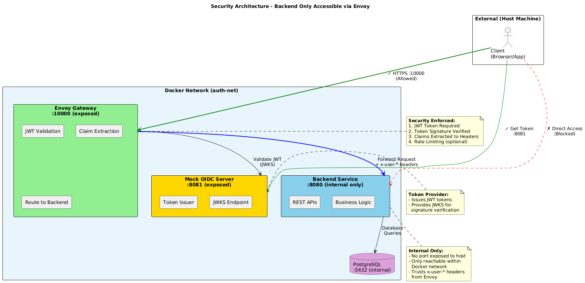

# Credentials Manager Application

A secure credential management system built with Spring Boot, Envoy Proxy, and OAuth2/OIDC authentication.

## Table of Contents

- [Overview](#overview)
- [Architecture](#architecture)
- [Security Flow](#security-flow)
- [Prerequisites](#prerequisites)
- [Quick Start](#quick-start)
- [API Endpoints](#api-endpoints)
- [Testing](#testing)
- [Configuration](#configuration)
- [Project Structure](#project-structure)

---

## Overview

This application provides a secure way to manage credentials (API keys, secrets) with:

- **OAuth2/OIDC Authentication** via Envoy Gateway
- **JWT Token Validation** with claim extraction
- **Organization-based Multi-tenancy**
- **Credential Lifecycle Management** (Create, Read, Reset, Delete)
- **Secret Masking** for secure retrieval

---

## Architecture

### High-Level Architecture

```
┌─────────────────────────────────────────────────────────────────────────────┐
│                              Docker Network (auth-net)                       │
│                                                                              │
│   ┌──────────┐       ┌─────────────────┐       ┌────────────────────┐       │
│   │  Client  │       │  Envoy Gateway  │       │  Backend Service   │       │
│   │ (Browser)│──────▶│    :10000       │──────▶│  :8080 (internal)  │       │
│   └──────────┘       └─────────────────┘       └────────────────────┘       │
│        │                     │                          │                    │
│        │                     │                          │                    │
│        ▼                     ▼                          ▼                    │
│   ┌──────────┐       ┌─────────────────┐       ┌────────────────────┐       │
│   │Mock OIDC │       │  JWT Validation │       │    PostgreSQL      │       │
│   │  :8081   │◀──────│  + Claims       │       │  :5432 (internal)  │       │
│   └──────────┘       └─────────────────┘       └────────────────────┘       │
│                                                                              │
└─────────────────────────────────────────────────────────────────────────────┘
```

### Component Details

| Component | Port | Access | Description |
|-----------|------|--------|-------------|
| **Envoy Gateway** | 10000 | External | API Gateway with JWT validation |
| **Mock OIDC Server** | 8081 | External | OAuth2/OIDC token provider |
| **Backend Service** | 8080 | Internal Only | Spring Boot REST API |
| **PostgreSQL** | 5432 | Internal Only | Database |

### Security Architecture



**Key Security Features:**
- ✅ All traffic goes through Envoy Gateway on port 10000
- ❌ Direct access to Backend (port 8080) is blocked
- ❌ Direct access to PostgreSQL (port 5432) is blocked
- 🔐 JWT validation enforced at gateway level
- 📋 Claims extracted and forwarded as headers

---

## Security Flow

### Authorization Code Flow (User Login)


**Flow Steps:**
1. **Authorization** - User visits `/authorize` endpoint, authenticates, and receives authorization code
2. **Token Exchange** - Client exchanges authorization code for Access Token + ID Token
3. **API Call** - Client calls API with Bearer token, Envoy validates JWT and extracts claims to headers

### JWT Claims Extraction

Envoy extracts the following claims from JWT and forwards them as headers:

| JWT Claim | HTTP Header | Description |
|-----------|-------------|-------------|
| `sub` | `x-user-sub` | User's subject ID |
| `email` | `x-user-email` | User's email |
| `name` | `x-user-name` | User's name |
| `organization` | `x-user-org` | User's organization |

---

## Prerequisites

- Docker & Docker Compose
- bash shell
- curl
- jq (for JSON parsing)

---

## Quick Start

### 1. Clone and Start Services

```bash
# Clone the repository
git clone <repository-url>
cd credentials-app

# Start all services
docker compose up -d --build

# Wait for services to be ready
sleep 10
```

### 2. Verify Services are Running

```bash
docker compose ps
```

### 3. Run Integration Tests

```bash
# Run with default user (admin-user)
./frontend/integration-test.sh

# Run with specific user
./frontend/integration-test.sh admin-user
./frontend/integration-test.sh regular-user
./frontend/integration-test.sh saravanan
```

### 4. Access Swagger UI

Open in browser: http://localhost:10000/credential-manager/swagger-ui.html

---

## API Endpoints

### User APIs

| Method | Endpoint | Description | Auth Required |
|--------|----------|-------------|---------------|
| `POST` | `/api/v1/users/login` | User login / First-time registration | Yes |
| `GET` | `/api/v1/users` | Get all users | Yes |
| `GET` | `/api/v1/users/{userId}` | Get user by ID | Yes |

### Credential APIs

| Method | Endpoint | Description | Auth Required |
|--------|----------|-------------|---------------|
| `POST` | `/api/v1/credentials` | Create new credential | Yes + x-org-id |
| `GET` | `/api/v1/credentials/{id}` | Get credential by ID (masked) | Yes |
| `PATCH` | `/api/v1/credentials/{id}/reset-secret` | Reset credential secret | Yes |
| `DELETE` | `/api/v1/credentials/{id}` | Delete credential | Yes |

### Headers Required

| Header | Description | Required For |
|--------|-------------|--------------|
| `Authorization` | Bearer JWT token | All protected endpoints |
| `x-org-id` | Organization ID for session | Credential operations |

---

## Testing

### Test Scripts

| Script | Purpose |
|--------|---------|
| `frontend/integration-test.sh` | Full integration test suite |
| `frontend/verify-token.sh` | Verify JWT token generation |

### Integration Test Flow

The integration test (`integration-test.sh`) covers:

#### Security Tests (Step 3.1)
| Test | Description |
|------|-------------|
| 3.1.1 | Missing JWT returns 401 |
| 3.1.2 | Invalid JWT returns 401 |
| 3.1.3 | Tampered JWT returns 401 |
| 3.1.4 | Wrong auth scheme returns 401 |

#### User Flow Tests (Step 4.1)
| Test | Description |
|------|-------------|
| 4.1.1 | First-time login - get available organizations |
| 4.1.2 | Select organization and complete registration |
| 4.1.3 | Re-login with x-org-id header (session context) |

#### Credential CRUD Tests (Step 4.2)
| Test | Description |
|------|-------------|
| 4.2.1 | CREATE credential |
| 4.2.2 | GET credential by ID (verify secret is MASKED) |
| 4.2.3 | RESET credential secret |
| 4.2.4 | DELETE credential |
| 4.2.5 | GET deleted credential (expect 404) |

### Running Tests

```bash
# Full integration test
./frontend/integration-test.sh admin-user

# Verify token only
./frontend/verify-token.sh admin-user

# Test with different users
./frontend/integration-test.sh saravanan
./frontend/integration-test.sh regular-user
```

### Expected Output

```
============================================================================
   Integration Test Summary
============================================================================

  ✓ Token claims match expected values
  ✓ Missing JWT returns 401 Unauthorized
  ✓ Invalid JWT returns 401 Unauthorized
  ✓ Tampered JWT returns 401 Unauthorized
  ✓ Wrong auth scheme returns 401 Unauthorized
  ✓ GET /api/v1/users returned HTTP 200
  ✓ POST /api/v1/users/login returned HTTP 200
  ✓ Re-login with x-org-id successful
  ✓ CREATE credential successful
  ✓ GET credential by ID successful
  ✓ GET credential returns MASKED secret
  ✓ RESET credential secret successful
  ✓ RESET generated new secret
  ✓ DELETE credential successful
  ✓ GET deleted credential returns 404

  Tests Passed: 15
  Tests Failed: 0

  ━━━━━━━━━━━━━━━━━━━━━━━━━━━━━━━━━━━━━━━━━━━━━━━━━━━━━━━━━━━━━━━━━━━━━━━━━━
     ✅ ALL TESTS PASSED
  ━━━━━━━━━━━━━━━━━━━━━━━━━━━━━━━━━━━━━━━━━━━━━━━━━━━━━━━━━━━━━━━━━━━━━━━━━━
```

---

## Configuration

### Mock OIDC Users

Configured in `proxy/mock-oidc-config.json`:

| Client ID | Subject | Email | Roles |
|-----------|---------|-------|-------|
| `admin-user` | admin-123 | admin@test.com | admin, user |
| `regular-user` | user-456 | user@test.com | user |
| `saravanan` | saravanan-789 | saravanan@test.com | admin, user, developer |

### Environment Variables

| Variable | Description | Default |
|----------|-------------|---------|
| `SPRING_DATASOURCE_HOST` | Database host | postgres |
| `POSTGRES_USER` | Database user | user |
| `POSTGRES_PASSWORD` | Database password | password |

---

## Project Structure

```
credentials-app/
├── docker-compose.yml          # Docker orchestration
├── README.md                   # This file
│
├── backend/
│   └── credential-manager/
│       ├── Dockerfile
│       ├── pom.xml
│       └── src/
│           └── main/java/com/credentials/
│               ├── controller/     # REST Controllers
│               ├── service/        # Business Logic
│               ├── entity/         # JPA Entities
│               ├── dto/            # Data Transfer Objects
│               ├── repo/           # Repositories
│               ├── security/       # Encryption Utils
│               ├── filter/         # Request Filters
│               └── mapper/         # Object Mappers
│
├── proxy/
│   ├── Dockerfile
│   ├── envoy.yaml              # Envoy configuration
│   └── mock-oidc-config.json   # Mock OIDC user config
│
└── frontend/
    ├── integration-test.sh     # Full integration test
    └── verify-token.sh         # Token verification script
```

---

## Credential Flow

### First-Time User Flow

```
1. User logs in via OAuth
         │
         ▼
2. POST /api/v1/users/login
   Response: { isFirstLogin: true, availableOrgs: [...] }
         │
         ▼
3. User selects organization
         │
         ▼
4. POST /api/v1/users/login + selectedOrgIds
   Response: { isFirstLogin: true, associatedOrgs: [...] }
         │
         ▼
5. User is registered and associated with org
```

### Returning User Flow

```
1. User logs in via OAuth
         │
         ▼
2. POST /api/v1/users/login
   Response: { isFirstLogin: false, associatedOrgs: [...] }
         │
         ▼
3. If single org → Auto-selected
   If multiple orgs → User selects via x-org-id header
         │
         ▼
4. User proceeds with selected org context
```

### Credential Lifecycle

```
┌─────────────────────────────────────────────────────────────┐
│                    Credential Lifecycle                      │
├─────────────────────────────────────────────────────────────┤
│                                                              │
│   CREATE                GET                 RESET            │
│   ┌─────┐              ┌─────┐             ┌─────┐          │
│   │ POST│───────────▶  │ GET │──────────▶  │PATCH│          │
│   └─────┘              └─────┘             └─────┘          │
│      │                    │                   │              │
│      ▼                    ▼                   ▼              │
│   Returns:             Returns:            Returns:          │
│   - id                 - id                - id              │
│   - clientId           - clientId          - clientId        │
│   - clientSecret       - clientSecret      - clientSecret    │
│     (UNMASKED)           (MASKED)            (NEW/UNMASKED)  │
│                                                              │
│                        DELETE                                │
│                        ┌──────┐                              │
│                        │DELETE│                              │
│                        └──────┘                              │
│                           │                                  │
│                           ▼                                  │
│                      Returns: 204                            │
│                      GET after: 404                          │
│                                                              │
└─────────────────────────────────────────────────────────────┘
```

---

## Troubleshooting

### Common Issues

| Issue | Solution |
|-------|----------|
| Connection refused on :8080 | Backend is internal-only. Use Envoy on :10000 |
| 401 Unauthorized | Check JWT token is valid and not expired |
| 400 Bad Request on credentials | Ensure x-org-id header is set |
| User not found | User needs to login first to register |

### Useful Commands

```bash
# View all logs
docker compose logs -f

# View specific service logs
docker compose logs backend_service -f
docker compose logs envoy -f

# Restart services
docker compose restart

# Clean restart (removes volumes)
docker compose down -v && docker compose up -d --build

# Check running containers
docker compose ps
```

---

## License

[Add your license here]

---

## Contributing

[Add contribution guidelines here]
